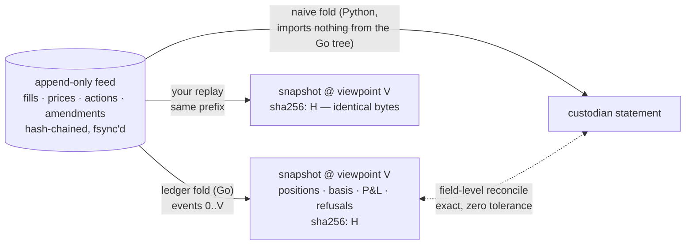

# MERIDIAN

An event-sourced portfolio ledger whose every number can be recomputed, by
anyone, to the byte.

## Premise

**A position is not a number in a table. It is a fold over an append-only feed
— and anyone holding the feed can recompute it to the byte.**

Most portfolio systems store positions and defend them with reconciliation
after the fact. MERIDIAN inverts that: the only durable input is a
hash-chained, append-only feed of events (fills, prices, corporate actions,
amendments), and everything else — positions, cost basis, P&L, refusal records
— is the output of a deterministic fold over it. There is no stored derived
state to drift, patch, or trust. A snapshot is a content-addressed artifact
stamped with the feed prefix it derives from; if your replay of that prefix
produces different bytes, one of us is wrong and the feed will say who.

Corporate actions are the hard case, and the reason this design exists: a
split rewrites position history, but what the ledger *knew before it was
processed* must remain exactly readable. Feed order is knowledge time — the
only clock — so an as-of read at viewpoint V folds precisely the events known
by V, and an amendment is just a later event: three viewpoints around an
amended action see three distinct, internally consistent histories. The
point-in-time discipline this transplants was first proven on SEC fundamentals
(see Lineage).

## The value

Job specs for financial infrastructure ask for systems that are fast **and**
provably correct. Fast is an adjective; this repo trades it for a property:
every claim below is a gate that has been shown to pass on clean input *and*
fail on a planted defect — a gate that has never run red proves nothing.

The properties, each claimable only when its live gate is green, **every**
known-bad twin is red for exactly its planted reason, **and** every check the
live gate reports has been driven nonzero by at least one of those twins:

1. **At-most-once ingestion** — duplicate fills are absorbed; a same-key,
   different-payload collision is a durable refusal, not a downstream surprise.
2. **Deterministic replay** — same feed prefix, byte-identical snapshot,
   hash-verified. No wallclock, no floats, one stated rounding rule.
3. **Point-in-time corporate actions** — splits, dividends, and an amended
   action restate history without lookahead; every viewpoint keeps what it saw.
4. **Fail-closed valuation** — a missing price is a durable `unevaluable`
   record scoped to exactly the dependent positions, never a silent zero.
5. **Reconciliation proven able to fail** — snapshots reconcile exactly against
   statements from an independent naive fold; planted drift names the
   instrument and the amount.
6. **Portfolio math** — average-cost basis and realized/unrealized P&L as fold
   state, matched to a hand-computed golden fixture to the cent.
7. **Wire fidelity of the gRPC read API** — what a client receives matches a
   local recompute: `Head` on its record count and prefix hash, `AsOf` on its
   sequence, prefix hash and snapshot bytes, and `Reconcile` on its compared
   count and its mismatches, compared as a multiset; a server serving the wrong
   feed as base, or a snapshot under a mislabeled hash, is caught.

Claim state lives in [STATUS.md](STATUS.md) — the state of record; this README
never carries counts.

## Scope walls

- Synthetic, versioned fixtures only — the generator plants the truth; the
  ledger must recover it. No market connectivity, live vendors, order
  management, or execution.
- No performance vocabulary and no benchmarks. The speed claim is: replayable
  and byte-identical. Full stop.
- Named non-goals: lot selection, multi-currency/FX, symbol changes, spin-offs,
  mergers, fractional shares.
- **No production claim.** This is a demonstration of properties, not a system
  that has run anywhere that matters.

## Run the gates

    python fixtures/generate.py   # regenerate fixtures (deterministic; CI checks freshness)
    sh gates/run.sh               # every live gate green, every twin red for its planted reason
    bin/meridian serve --feed fixtures/base/feed.jsonl   # read-only gRPC: Head / AsOf / Reconcile (api/meridian/v1/read.proto)

Claim state is in [STATUS.md](STATUS.md).

## Conformance

Verdict rows are emitted in a shared row shape. Its specification (a JSON
schema), a reference checker, the checker's own negative controls and a
fixture corpus are vendored under `gates/conformance/`, bound file by file,
by sha256, to one pushed commit of a private governing text (see Lineage)
by `gates/conformance/PIN`. The pinned commit is in that file; this README
carries no revision.

`gates/run.sh` runs, in this order: the pin, verified by the vendored
checker before any other vendored code runs; the checker's self-test, rule mutation included; the
self-test of `gates/claimability.py`; the gates, which write fresh rows into
`gates/out`; both derivations of claimability over those rows,
`gates/claimability.py` and the pack, the pack with the pin verified again
and with `gates/expect.json` naming every surface and its exact twin
mutations; and the agreement step, which fails unless both derivations give
every property the same status and name the same unfalsified checks. The
claimability table in STATUS.md is generated from the rows and compared in
CI, never typed.

    node gates/conformance/check.mjs --verify-pin      # the vendored bytes are the pinned ones
    node gates/conformance/test.mjs --mutate           # the checker's own controls
    python gates/claimability.py --self-test           # the second derivation's own controls
    node gates/conformance/check.mjs gates/out --verify-pin --expect gates/expect.json

Crediting is per check. A property is claimable only when its live row is
green, every twin row is red for exactly its planted reason, and every check
the live row reports has been set nonzero by at least one of those twins. A
check that no such twin drives nonzero is unfalsified: its zero in the live
row has never been shown able to be anything else, so it holds the property
short of claimable, and both derivations name it. A property with an
unevaluable row is unevaluable, and none of its checks is credited.

What the pack checks by machine: every row has exactly the specified shape,
with no missing or unknown keys and no status word typed into it, and
carries its content hash, the emitting commit and that commit's worktree
state; a twin is red only for exactly its planted counts; a surface has at
most one live row and no repeated twin mutation; a red live row or a green
twin is refused for a human to look at; the surfaces and twin mutations are
exactly the expected ones; and the vendored files are exactly the pinned
ones. Status is derived from rows, never authored. The governing text's
other rules are not machine-checked by the pack, and this README does not
claim conformance to them.

## Lineage

MERIDIAN belongs to a family of instruments for checkable financial-data
claims: [VANTAGE](https://github.com/hossainpazooki/vantage) produces
point-in-time SEC fundamentals, [PARALLAX](https://github.com/hossainpazooki/parallax)
adversarially re-derives them from the consumer side, and
[BASELINE](https://hossainpazooki.github.io/baseline) is the ledger of
dated, replayable verdicts from that gate. MERIDIAN re-lands the discipline
in portfolio accounting. The shared thing across these repos is the row and
the crediting rule, not a page. That discipline is written down once, in
DATUM, a private governing text; this repo vendors its conformance pack and
runs it in `gates/run.sh` (see Conformance), and nothing registers into
BASELINE. Everything this repo claims is checkable from this repo alone.

Design and reasoning: [docs/2026-08-31-design.md](docs/2026-08-31-design.md).
