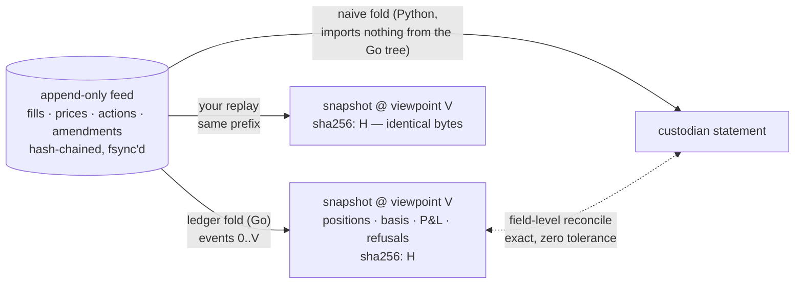

# MERIDIAN

An event-sourced portfolio ledger whose every number can be recomputed, by
anyone, to the byte.

## Premise

**A position is not a number in a table. It is a fold over an append-only feed
— and anyone holding the feed can recompute it to the byte.**

Most portfolio systems store positions and defend them with reconciliation
after the fact. MERIDIAN inverts that: the only durable input is a
hash-chained, append-only feed of events (fills, prices, corporate actions,
amendments), and everything else — positions, cost basis, P&L, refusal records
— is the output of a deterministic fold over it. There is no stored derived
state to drift, patch, or trust. A snapshot is a content-addressed artifact
stamped with the feed prefix it derives from; if your replay of that prefix
produces different bytes, one of us is wrong and the feed will say who.

Corporate actions are the hard case, and the reason this design exists: a
split rewrites position history, but what the ledger *knew before it was
processed* must remain exactly readable. Feed order is knowledge time — the
only clock — so an as-of read at viewpoint V folds precisely the events known
by V, and an amendment is just a later event: three viewpoints around an
amended action see three distinct, internally consistent histories. The
point-in-time discipline this transplants was first proven on SEC fundamentals
(see Lineage).

## The value

Job specs for financial infrastructure ask for systems that are fast **and**
provably correct. Fast is an adjective; this repo trades it for a property:
every claim below is a gate that has been shown to pass on clean input *and*
fail on a planted defect — a gate that has never run red proves nothing.

Six properties, each claimable only when its live gate is green **and** its
known-bad twin is red for exactly the planted reason:

1. **At-most-once ingestion** — duplicate fills are absorbed; a same-key,
   different-payload collision is a durable refusal, not a downstream surprise.
2. **Deterministic replay** — same feed prefix, byte-identical snapshot,
   hash-verified. No wallclock, no floats, one stated rounding rule.
3. **Point-in-time corporate actions** — splits, dividends, and an amended
   action restate history without lookahead; every viewpoint keeps what it saw.
4. **Fail-closed valuation** — a missing price is a durable `unevaluable`
   record scoped to exactly the dependent positions, never a silent zero.
5. **Reconciliation proven able to fail** — snapshots reconcile exactly against
   statements from an independent naive fold; planted drift names the
   instrument and the amount.
6. **Portfolio math** — average-cost basis and realized/unrealized P&L as fold
   state, matched to a hand-computed golden fixture to the cent.

Claim state lives in [STATUS.md](STATUS.md) — the state of record; this README
never carries counts.

## Scope walls

- Synthetic, versioned fixtures only — the generator plants the truth; the
  ledger must recover it. No market connectivity, live vendors, order
  management, or execution.
- No performance vocabulary and no benchmarks. The speed claim is: replayable
  and byte-identical. Full stop.
- Named non-goals: lot selection, multi-currency/FX, symbol changes, spin-offs,
  mergers, fractional shares.
- **No production claim.** This is a demonstration of properties, not a system
  that has run anywhere that matters.

## Lineage

MERIDIAN is an instrument of **DATUM** — a shared reference frame for
checkable financial-data claims: [VANTAGE](https://github.com/hossainpazooki/vantage)
produces point-in-time SEC fundamentals, [PARALLAX](https://github.com/hossainpazooki/parallax)
adversarially re-derives them from the consumer side, and
[BASELINE](https://hossainpazooki.github.io/baseline) is the public catalog of
dated, replayable verdicts. MERIDIAN re-lands that discipline in portfolio
accounting; its verdicts are emitted in BASELINE's row schema so they can
register into the catalog once earned.

Design and reasoning: [docs/2026-08-31-design.md](docs/2026-08-31-design.md).
